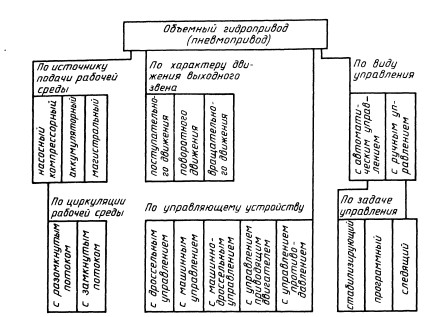

# Способы регулирования ОГП. По регулируемому устройству

В зависимости от задачи управления (регулирования) различают ОГП ***стабилизирующий***, ***программный*** и ***следящий***.

***Следящим гидроприводом*** называют такой регулируемый гидро­привод, в котором выходное звено повторяет движения звена управ­ления.
