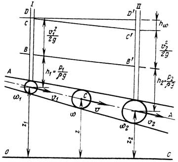
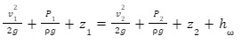

# Уравнение Бернулли для элементарной струйки вязкой реальной жидкости

При движении реальной жидкости часть энергии затрачивается на преодоление силы трения (сопротивления) на пути от первого сечения до второго. Эта энергия обращается в тепло и рассеивается. Величину потерь обозначим ***hw***.

Тогда баланс энергии в сечениях I и II (уравнение Бернулли для реального потока жидкости) можно записать:

