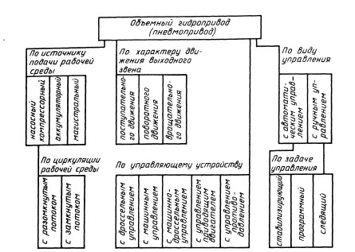

# Способы регулирования ОГП. Классификация по способу регулирования

***Дроссельное управление*** (дроссельное регулирование) движением выходного звена осуществляется регулирующим гидроаппаратом.

***Машинное управление*** (объемное регулирование) движением выходного звена применимо только к гидроприводу и выполняется регулируемым насосом, регулируемым гидромотором или обеими регулируемыми гидромашинами.

***Управление приводящим двигателем*** применимо к объемному гидроприводу и состоит в управлении скоростью движения выходного звена путем изменения частоты вращения приводящего двигателя.

Управление противодавлением иногда осуществляется в пневмоприводе созданием противодавления на выходе пневмодвигателя.