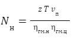
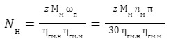

# Расчет усилий и моментов, действующих на исполнительные органы приводов. Расчет мощности

Мощность привода нерегулируемого насоса определяется по формулам:

для привода гидроцилиндров:

для привода гидромоторов.

где z - число одновременно включаемых гидроцилиндров и гидромоторов;
Т - усилие на штоке гидроцилиндра, Н;
vп - скорость поршня, м/с;
Мм - крутящий момент на валу гидромотора Н м;
ωм - угловая скорость на валу гидромотора, c^(-1);
nм - число оборотов вала гидромотора, об/мин;
ηгм.н, ηгм.ц, ηгм.м - гидромеханические КПД насоса, гидроцилиндра и гидромотора соответственно.
