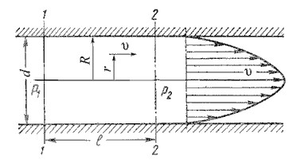

# Общие понятия о гидравлических сопротивлениях

***Гидравлическое сопротивление*** или гидравлические потери – это суммарные потери при движении жидкости по водопроводящим каналам. Их условно можно разделить на две категории:

***Потери трения*** – возникают при движении жидкости в трубах, каналах или проточной части насоса.

***Потери на вихреобразование*** – возникают при обтекании потоком жидкости различных элементов. Например, внезапное расширение трубы, внезапное сужение трубы, поворот, клапан и т. п. Такие потери принято называть местными гидравлическими сопротивлениями.

Гидравлические потери выражают либо в потерях напора Δh в линейных единицах столба среды, либо в единицах давления ΔP:

    Δh= ΔP / (ρ g)

где ρ — плотность среды, g — ускорение свободного падения.

***Ламинарным*** называется слоистое течение без перемешивания частиц жидкости и без пульсации скорости и давления. При ламинарном течении жидкости в прямой трубе постоянного сечения все линии тока направлены параллельно оси трубы, при этом отсутствуют поперечные перемещения частиц жидкости.

***Турбулентным*** называется течение, сопровождающееся интенсивным перемешиванием жидкости с пульсациями скоростей и давлений. Наряду с основным продольным перемещением жидкости наблюдаются поперечные перемещения и вращательные движения отдельных объемов жидкости.

***Переход от ламинарного режима к турбулентному*** наблюдается при определенной скорости движения жидкости. Эта скорость называется критической Vкр.

Значение этой скорости прямо пропорционально кинематической вязкости жидкости и обратно пропорционально диаметру трубы:

    Vкр = (ν / d ) k

где ν - кинематическая вязкость;
k - безразмерный коэффициент;
d - внутренний диаметр трубы.

Входящий в эту формулу безразмерный коэффициент k, одинаков для всех жидкостей и газов, а также для любых диаметров труб. Этот коэффициент называется критическим числом Рейнольдса Reкр и определяется следующим образом:

Как показывает опыт, для труб круглого сечения Reкр примерно равно 2300.

Таким образом, критерий подобия Рейнольдса позволяет судить о режиме течения жидкости в трубе. При Re < Reкр течение является ламинарным, а при Re > Reкр течение является турбулентным. Точнее говоря, вполне развитое турбулентное течение в трубах устанавливается лишь при Re примерно равно 4000, а при Re = 2300…4000 имеет место переходная, критическая область.

Режим движения жидкости напрямую влияет на степень гидравлического сопротивления трубопроводов.

## Потери напора при ламинарном течении жидкости

где λ - коэффициент гидравлического трения, который для ламинарного потока вычисляется по выражению:

днако при ламинарном режиме для определения коэффициента гидравлического трения λ Т.М. Башта рекомендует при Re < 2300 применять формулу:

## Потери напора при турбулентном течении жидкости

Прямая I соответствует ламинарному режиму движения жидкости.

Далее на графике можно рассматривать три области.

***Первая область*** - область малых Re и Δ/r0, где коэффициент λ не зависит от шероховатости, а определяется лишь числом Re (отмечена на рис.4.7 прямой II ). Это область гидравлически гладких труб.

Во ***второй области***, расположенной между линий II и пунктирной линией справа, коэффициент λ зависит одновременно от двух параметров - числа Re и относительной шероховатости Δ/r0, которую можно заменить на Δэ. 

***Третья область*** - область больших Re и Δ/r0, где коэффициент λ не зависит от числа Re, а определяется лишь относительной шероховатостью (область расположена справа от пунктирной линии). Это область шероховатых труб, в которой все линии с различными шероховатостями параллельны между собой. Эту область называют областью ***автомодельности*** или ***режимом квадратичного сопротивления***, т.к. здесь гидравлические потери пропорциональны квадрату скорости.

где Δэ - эквивалентная абсолютная шероховатость.

Характерные значения Δэ (в мм) для труб из различных материалов приведены ниже:

Стекло 	0

Трубы, тянутые из латуни, свинца, меди  0…0,002

Высококачественные бесшовные стальные трубы	0,06…0,2

Стальные трубы	0,1…0,5

Чугунные асфальтированные трубы	0,1…0,2

Чугунные трубы	0,2…1,0