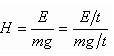

# Параметры гидравлических машин. Определение к.п.д. гидравлических машин

Основными параметрами гидравлических машин для подачи жидкостей и газов (нагнетателей) являются ***подача***, ***напор*** (или развиваемое давление), ***потребляемая мощность*** и ***КПД***.

Соответственно различают производительность ***объемную Q***, м3/с, и ***массовую G***, кг/с.

В расчетах принято приводить объемную подачу к условиям всасывания (для вакуум-насосов — к условиям на линии нагнетания) или к нормальным условиям, т. е. к давлению 100 кПа и температуре 293 К.

***Напор насоса*** (м) — это удельная механическая энергия, сообщаемая насосом жидкости в единицу времени:

где Е — полная механическая энергия, сообщаемая жидкости за время t, Дж;
m — масса жидкости, протекающей через насос за время t, кг;
g — ускорение свободного падения, м/с2.

***Потребляемая мощность*** N — это мощность, потребляемая насосом (вентилятором) при перекачивании жидкости (газа) от механического привода, т. е. она может быть измерена на приводном валу насоса.

    N = Мн ω

Мн - момент на валу насоса, Н м;
ω - угловая скорость, рад/сек;

***Полезная мощность*** (мощность, сообщаемая насосом жидкости) при известных производительности и напоре определяется из выражения:

    Nп = ρ g Qд Hн

Qд - действительная подача насоса

***КПД насоса***:

    ηн = Nп / N = (ρ g Qд Hн)/(Мн ω)

Потери можности подразделяются на гидравлические, объемные и механические

***Гидравлические потери*** - потери на преодоление гидравлических сопротивлений при движении рабочей жидкости внутри ГМ:

    ηг = Нн / Нт = Нн / (Нн + Σhг)

Нн - действительный напор, передаваемый рабочей жидкостью;
Нт - теоретический напор

***Объемные потери*** - потери на утечки и циркуляцию рабочей жидкости в зазорах внутри ГМ из области высокого давления в область низкого

    ηо = Qд / Qт = (Qт - qут) / Qт

Qт - теоретическая подача насоса.

***Механические потери*** - потери на механическое трение в подшипниках и уплотнениях.

    ηм = (N - ΔNт) / N = Nг / N

ΔNт - мощность на преодоление сил трения;
Nг - гидравлическая мощность, мощность, которую передал бы насос при отсутсвии объемных и механических потерь.

    Nг = N - ΔNт = (Нн + Σhг) ρ g (Qд + qут)

***Общий КПД насоса***:

    ηн = ηг ηо ηм
