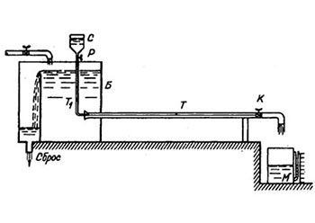

# Режимы движения жидкости. Опыты Рейнольдса

Эксперименты О.Рейнольдса показали, что при движении жидкости , последняя теряет определенное количество энергии. Эти потери зависят от особенностей движения частиц жидкости в потоке и от самого режима течения.

## Опыт Рейнольдса

Опыты проводились на специальном лабораторном стенде, который представлял собой заполненный водой бак Б к которому в нижней части присоединена стеклянная трубка Т. На конце трубки установлен кран К для регулирования расхода жидкости. Расход измеряется с помощью секундомера и мерного бочка М. Бак Б постоянно заполняется водой. Над баком Б расположена ёмкость с краской С. По тонкой трубочке Т1 краска попадает в жидкость, движущуюся в трубке Т. Подачу краски регулирует кран Р.

### Опыт №1

Немного приоткрываем кран К. При этом в трубке Т начинается движение жидкости. Открываем кран Р и добавляем в жидкость краску. При небольшой скорости движения в трубке Т краска становится прямолинейной и резко выделяющейся в потоке воды цветной струйкой. Эта струйка не перемешивается с остальной жидкостью. Если ввести в жидкость краску несколькими струйками, то они так и будут двигаться не перемешиваясь с остальной водой.

Движение жидкости, наблюдаемое при малых скоростях, при котором отдельные струйки жидкости движутся параллельно друг другу и оси потока, называют ***ламинарным*** (от латинского ламина - слой) или струйчатым движением (режимом). Ламинарное движение может рассматриваться как движение отдельных слоев жидкости, происходящее без перемешивания частиц.

### Опыт №2

При намного большем открытии крана струйка краски начинает искривляться и становится волнообразной. Открывая кран ещё больше и увеличивая скорость потока мы увидим, что струйка краски распадается на отдельные вихри и перемешивается с остальной массой воды.

Движение жидкости, которое наблюдается при больших скоростях, называется ***турбулентным*** (по латински турбулентус - вихревой) движением (режимом). В этом случае в движении жидкости нет видимой закономерности. Отдельные частицы перемешиваются между собой и движутся по самым причудливым, все время меняющимся траекториям весьма сложной формы. Поэтому такое движение называется беспорядочным.
