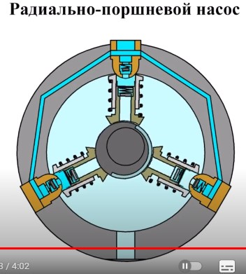

# Клапанные и поршневые насосы. Достоинства и недостатки

## Достоинства

* независимость производительности от напора;
* самовсасывающие;
* высокий кпд;
* тихоходность.

## Недостатки

* габариты, металлоемкость, сложность конструкции;
* необходимость тяжелого основания (высокие пульсации);
* необходимость постоянного ухода за клапанам;
* необходимость в промежуточной передаче между насосом и двигателем;
* неравномерность всасывания и нагнетания;
* низкая производительность.
