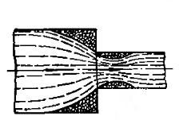
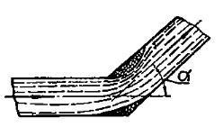
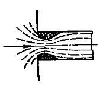
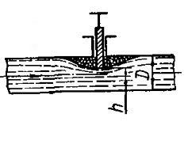
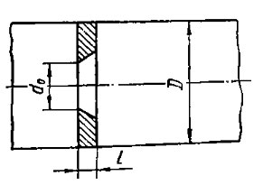
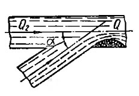

# Местные сопротивления

Аналитически потери напора на местные гидравлические сопротивления выражаются в виде:

    hг = ξм υ2 / (2 g)

где ξм – коэффициент местного сопротивления (обычно определяется опытным путем).

## Гидравлические потери на внезапное сужение трубы

Значение коэффициента местного сопротивления при внезапном сужении трубы можно определить по формуле.

    ξвн. суж = 0,5 (1 - (F2 / F1))

## Гидравлические потери при изменении направления трубопровода под некоторым углом

    ξповорот = 0,946 sin(α/2) + 2.047 sin(α/2)^2

где α – угол поворота трубопровода.

## Местные гидравлические сопротивления при входе в трубу

В частном случае вход в трубу может иметь острую или закругленную кромку входа. Труба, в которую входит жидкость, может быть расположена под некоторым углом α к горизонтали. Наконец, в сечении входа может стоять диафрагма, сужающая сечение. Но для всех этих случаев характерно начальное сжатие струи, а затем её расширение. Таким образом и местное сопротивление при входе в трубу может быть сведено к ***внезапному расширению струи***:

    ξвх = (1 - F1/F2)^2

Если жидкость входит в цилиндрическую трубу с острой кромкой входа и труба наклонена к горизонту под углом α, то величину коэффициента местного сопротивления можно определить по ***формуле Вейсбаха***:

    ξвх = 0,505 + 0,303sin α + 0,223 sin α^2

## Местные гидравлические сопротивления задвижки

Гидравлическое сопротивление полностью открытой запорной арматуры равно

    ξвентиля = от 2,9 до 4,5

Величины коэффициентов местных гидравлических сопротивлений для каждого вида запорной арматуры можно определить по справочникам.

## Гидравлические потери диафрагмы

Степень сужения и расширения струи зависит от ряда условий:

- указатель  режима движения жидкости
- указатель  отношения диаметров отверстия диафрагмы и трубы
- указатель  конструктивных особенностей диафрагмы.

Для диафрагмы с острыми краями:

 ξдиафр = d0^2 / D0^2

## Местные гидравлические сопротивления при входе струи под уровень жидкости

Преодоление местного сопротивления при входе струи под уровень жидкости в достаточно большой резервуар или в среду, не заполненную жидкостью, связано с потерей кинетической энергии. Следовательно, коэффициент сопротивления в этом случае равен единице.

    ξвхода = 1
