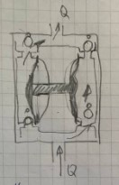

# Диафрагменный насос. Достоинства и недостатки

Насос работает с густыми, абразивными, взрывоопасными жидкостями.

## Достоинства

* Самовсасывание, кпд;
* Отсутствие контакта рабочей жидкости с движущейся частью штока;
* Отсутствие необходимости смазки механизма внутри камеры;
* Компактность, вес;
* Безопасность работы с воспламеняющимися жидкостями;
* Высокие температуры;
* Независимость давления от подачи.

## Недостатки

* Контакт многих частей механизма со средой;
* Сложность регулирования производительности;
* Дорогое обслуживание;
* Износ мембраны;
* Засорение;
* Пульсация подачи.
