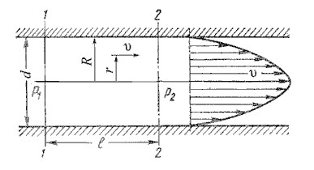

# Ламинарное течение жидкости

***Ламинарным*** называется слоистое течение без перемешивания частиц жидкости и без пульсации скорости и давления. При ламинарном течении жидкости в прямой трубе постоянного сечения все линии тока направлены параллельно оси трубы, при этом отсутствуют поперечные перемещения частиц жидкости.

***Переход от ламинарного режима к турбулентному*** наблюдается при определенной скорости движения жидкости. Эта скорость называется критической Vкр.

Значение этой скорости прямо пропорционально кинематической вязкости жидкости и обратно пропорционально диаметру трубы:

    Vкр = (ν / d ) k

где ν - кинематическая вязкость;
k - безразмерный коэффициент;
d - внутренний диаметр трубы.

Входящий в эту формулу безразмерный коэффициент k, одинаков для всех жидкостей и газов, а также для любых диаметров труб. Этот коэффициент называется критическим числом Рейнольдса Reкр и определяется следующим образом:

Как показывает опыт, для труб круглого сечения Reкр примерно равно 2300.

Таким образом, критерий подобия Рейнольдса позволяет судить о режиме течения жидкости в трубе. При Re < Reкр течение является ламинарным, а при Re > Reкр течение является турбулентным. Точнее говоря, вполне развитое турбулентное течение в трубах устанавливается лишь при Re примерно равно 4000, а при Re = 2300…4000 имеет место переходная, критическая область.

Режим движения жидкости напрямую влияет на степень гидравлического сопротивления трубопроводов.

## Потери напора при ламинарном течении жидкости

где λ - коэффициент гидравлического трения, который для ламинарного потока вычисляется по выражению:

днако при ламинарном режиме для определения коэффициента гидравлического трения λ Т.М. Башта рекомендует при Re < 2300 применять формулу:

