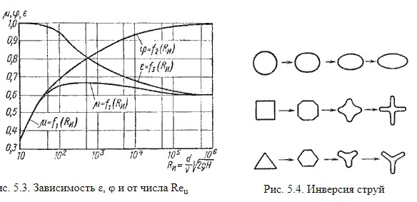

# Истечение жидкости из резервуаров

Степень сжатия оценивается коэффициентом сжатия:

где Sс и Sо - площади поперечного сечения струи и отверстия соответственно;
dс и dо - диаметры струи и отверстия соответственно.

Скорость истечения жидкости через отверстие такое отверстие:

где Н - напор жидкости, определяется как:

φ- коэффициент скорости:

где α - коэффициент Кориолиса;
ζ- коэффициент сопротивления отверстия.

Расход жидкости определяется как произведение действительной скорости истечения на фактическую площадь сечения:

Произведение ε и φ принято обозначать буквой μ и называть коэффициентом расхода, т.е. μ = εφ.

В итоге получаем расход:

Значение коэффициента сжатия ε, сопротивления ζ, скорости φ и расхода μ для круглого отверстия можно определить по эмпирически построенным зависимостям. На рис показаны зависимости коэффициентов ε, ζ и μ от числа Рейнольдса, подсчитанного для идеальной скорости:

При истечении струи в атмосферу из малого отверстия в тонкой стенке происходит изменение формы струи по ее длине, называемое инверсией струи (рис.5.4). Обуславливается это явление в основном действием сил поверхностного натяжения на вытекающие криволинейные струйки и различными условиями сжатия по периметру отверстия. Инверсия больше всего проявляется при истечении из некруглых отверстий.
