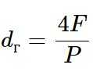

# Свойства жидкости. Динамика и кинематика потока жидкости. Общие понятия и определения

***Кинематика жидкости и газа*** — раздел гидромеханики, в котором изучают кинематические характеристики различных видов движения жидкости и газа без учета причин этого движения. В кинематике используется лишь одно свойство, общее для всех жидкостей и газов и присущее любой сплошной среде, — непрерывность распределения кинематических характеристик в пространстве и времени и дифференцируемость их в пространстве и времени.

***Кинематическими параметрами*** движения жидкости являются скорость, линия тока, траектория движения частиц жидкости, трубка тока, элементарная струйка.

Свойство текучести жидкости приводит к тому, что в пространстве движущейся жидкости скорость частицы жидкости зависит от координаты. Функция зависимости вектора скорости от координат и времени ***v(x,y,z,t)*** называют векторным полем скоростей. Если скорость жидкости в данной точке зависит от времени, то такое течение жидкости называют ***нестационарным***, а если не зависти от времени, — то ***стационарным***.

Линия, которую описывает частица жидкости, называют ***траекторией***.

***Линия тока*** — кривая, в каждой точке которой вектор скорости в данный момент времени направлен по касательной. При стационарном движении жидкости траектория частицы жидкости и линия тока совпадают, при нестационарном — не совпадают, так как они в общем случае описываются разными дифференциальными уравнениями, а физически — из-за инертности частиц, движущихся в нестационарном потоке.

Если в движущейся жидкости провести бесконечно малый замкнутый контур, так, чтобы нормаль к площади, охватываемой контуром, совпадала с направлением вектора скорости, и через все его точки провести линии тока, то совокупность этих линий тока образует поверхность тока, а часть жидкости, выделенная из нее поверхностью тока, проведенной через замкнутый контур, — ***трубку тока***.

***Струей*** называют часть жидкости, ограниченную поверхностью траекторий точек замкнутого контура. Если площадь поперечного сечения малая (***dF***), то ее называют ***струйкой***.

В случае стационарного поля скоростей, когда линии тока совпадают с траекторией, трубка тока совпадает со струей. При стремлении площади поперечного сечения струйки к нулю она в пределе стягивается в линию тока.

***Потоком жидкости*** в гидромеханике называют движущуюся массу жидкости, ограниченную направляющими твердыми поверхностями раздела жидкостей или свободными поверхностями.

***Живым сечением***, или ***сечением потока***, называют поверхность в пределах потока, проведенную нормально к линиям тока. Если струйки можно считать параллельными, то живые сечения будут плоскими. Разбив поток на элементарные струйки, получим, что площадь живого сечения потока равна сумме живых сечений элементарных струек.

***Смоченный периметр*** представляет собой длину линии, по которой жидкость в живом сечении соприкасается с твердыми поверхностями, ограничивающими поток.

Гидравлическим диаметром ***d***г называют учетверенное отношение площади живого сечения к смоченному периметру в этом сечении:

Движение жидкости также классифицируется на ***равномерное***, когда скорость не меняется по длине струйки, и ***неравномерное***, если постоянство скорости не соблюдается.

Вязкость жидкости и скорость течения определяют характер ее движения. По структуре все существующие потоки реальной вязкой жидкости делятся на ***ламинарные*** и ***турбулентные***. Когда режим перемещения жидкости имеет упорядоченный характер, он называется ламинарным. Хаотическое движение жидкости при активном импульсивном перемешивании соответствует турбулентному режиму.

Критерием оценки режима течения служит число Рейнольдса:

где d — геометрический параметр канала, м; w — скорость жидкости, м/с; v — кинематическая вязкость жидкости, м2/с.

Принято, что при Re < 2300 движение жидкости ламинарное, при Re > 100000 — турбулентное, а при 2300 < Re < 100000 имеет место переходный режим.

От структуры потока существенно зависят величины, характеризующие процессы переноса количества движения, теплоты и вещества.
