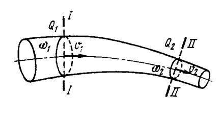
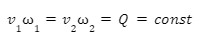
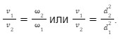

# Уравнение неразрывности потока

***Уравнение неразрывности элементарной струйки***: скорости и площади поперечных сечений струек в различных живых сечениях могут меняться, однако произведение скорости v отдельных частиц струйки на площади их поперечного сечения w остаются постоянными.

***Уравнение неразрывности потока*** гласит: при установившемся движении несжимаемой жидкости произведение средней скорости потока на площадь живого сечения является постоянной величиной.

Это означает, что через сечения потока жидкости в единицу времени проходит одно и то же количество жидкости:

Из этого следует, что средние скорости потока обратно пропорциональны площадям соответствующих сечений:

\sum_{\forall i}{x_i^{2}}