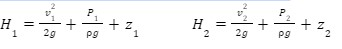

# Уравнение Бернулли. Геометрический смысл уравнения Бернулли

Тогда величины полной удельной энергии потока в сечениях I и II соответственно могут быть записаны:

***Геометрический смысл уравнения Бернулли*** заключается в том, что сумма трех высот (напоров) – геометрической, пьезометрической и скоростной – вдоль потока остается неизменной.
